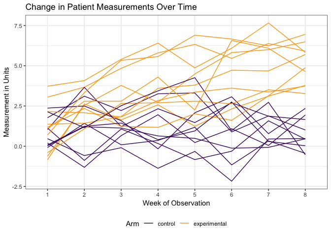
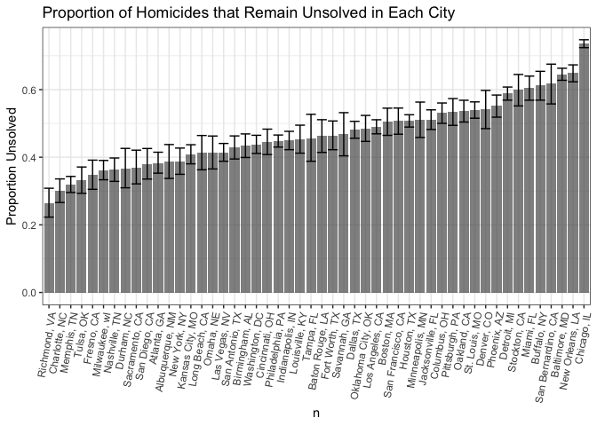

Homework 5
================
Sarah Vititoe
11/8/2018

### Problem 1

*This zip file contains data from a longitudinal study that included a control arm and an experimental arm. Data for each participant is included in a separate file, and file names include the subject ID and arm.*

*Create a tidy dataframe containing data from all participants, including the subject ID, arm, and observations over time:*

*Start with a dataframe containing all file names; the list.files function will help*

``` r
patient_files <- str_c("./data/", list.files(path = "./data", pattern = "^[ce][ox][np]_[0-9][0-9].csv$"))
```

``` r
read_records <- function(files){
  
  df <- read_csv(files, col_types = cols(.default = "d"))
  
  df
  
}
```

*Iterate over file names and read in data for each subject using purrr::map and saving the result as a new variable in the dataframe.*

*Tidy the result; manipulate file names to include control arm and subject ID, make sure weekly observations are “tidy”, and do any other tidying that’s necessary.*

``` r
patient_records <- patient_files %>% 
  tibble(record = .) %>% 
  group_by(record) %>% 
  nest %>% 
  mutate(data = map(.$record, read_records)) %>% 
  unnest() %>% 
  mutate(patient = str_extract(record, "[ce][ox][np]_[0-9][0-9]")) %>% 
  separate(col = patient, into = c("arm", "patient_id")) %>% 
  gather(key = "week", value = "measurement", starts_with("week")) %>% 
  mutate(arm = as.factor(recode(arm, con = "control", exp = "experimental")), 
          week = as.factor(str_replace(week, "week_", ""))) %>% 
  select(patient_id, arm, week, measurement)
```

*Make a spaghetti plot showing observations on each subject over time, and comment on differences between groups.*

``` r
patient_records %>% 
  mutate(unique_id = str_c(patient_id, arm)) %>% 
  ggplot(aes(x = week, y = measurement, group = unique_id, color = arm)) + 
  geom_line() + 
  viridis::scale_color_viridis(
      option = "inferno", 
      begin = .2, 
      end = .8,
      name = "Arm", 
      discrete = TRUE) +
  labs(
      title = "Change in Patient Measurements Over Time", 
      y = "Measurement in Units",
      x = "Week of Observation"
    ) +
    theme_bw() + 
    theme(legend.position = "bottom") 
```



We can see that patients in the control arm do not seem to change in their measurement values over time. Meanwhile, we see a slight increase in the measurements of patients in our experiemental group over time. It seems that by week 8, all patients in the experimental group have a higher value of their measurement, compared to the control group.

### Problem 2

*The Washington Post has gathered data on homicides in 50 large U.S. cities and made the data available through a GitHub repository here. You can read their accompanying article here.*

``` r
homicide <- read_csv("./data/homicide-data.csv") %>% 
  select(-contains("first"), -contains("last"))
```

    ## Parsed with column specification:
    ## cols(
    ##   uid = col_character(),
    ##   reported_date = col_integer(),
    ##   victim_last = col_character(),
    ##   victim_first = col_character(),
    ##   victim_race = col_character(),
    ##   victim_age = col_character(),
    ##   victim_sex = col_character(),
    ##   city = col_character(),
    ##   state = col_character(),
    ##   lat = col_double(),
    ##   lon = col_double(),
    ##   disposition = col_character()
    ## )

*Describe the raw data.*

Our data seems fairly clean. We have a record identifier, report date (that needs cleaning), demographic information about the victims, location information (city, state, lattitude, and longitude), and the case status. I'll immediately drop victim names, since I personally don't want to see any identifiable information.

*Create a city\_state variable (e.g. “Baltimore, MD”) and then summarize within cities to obtain the total number of homicides and the number of unsolved homicides (those for which the disposition is “Closed without arrest” or “Open/No arrest”).*

``` r
homicide <- homicide %>% 
  unite(col = city_state, city, state, sep = ", ")
```

I think there might be an error in this dataset due to the fact that there were supposed to be 50 cities, but I get 51 in this dataset instead. Our datapoint with the fewest observations is Tulsa, AL, with 1 observation. Since I know this city\_state doesn't exist, and can't say for sure if this is supposed to be Tulsa, OK, I will remove this datapoint, since there seems to be a data entry error.

``` r
homicide <- homicide %>% 
  filter(city_state != "Tulsa, AL")
```

``` r
homicide_nest <- homicide %>% 
  mutate(unsolved = as.numeric(ifelse(disposition == "Closed by arrest", 0, 1))) %>% 
  group_by(city_state) %>% 
  nest 
  
homicide_nest %>% 
  mutate(total_homicide = map(data, tally)) %>% 
  mutate(unsolved= map(data, ~sum(.$disposition != "Closed by arrest"))) %>% 
  select(-data) %>% 
  unnest() %>% 
  rename(total_homicide = n) %>% 
  arrange(desc(total_homicide)) %>% 
  knitr::kable()
```

| city\_state        |  unsolved|  total\_homicide|
|:-------------------|---------:|----------------:|
| Chicago, IL        |      4073|             5535|
| Philadelphia, PA   |      1360|             3037|
| Houston, TX        |      1493|             2942|
| Baltimore, MD      |      1825|             2827|
| Detroit, MI        |      1482|             2519|
| Los Angeles, CA    |      1106|             2257|
| St. Louis, MO      |       905|             1677|
| Dallas, TX         |       754|             1567|
| Memphis, TN        |       483|             1514|
| New Orleans, LA    |       930|             1434|
| Las Vegas, NV      |       572|             1381|
| Washington, DC     |       589|             1345|
| Indianapolis, IN   |       594|             1322|
| Kansas City, MO    |       486|             1190|
| Jacksonville, FL   |       597|             1168|
| Milwaukee, wI      |       403|             1115|
| Columbus, OH       |       575|             1084|
| Atlanta, GA        |       373|              973|
| Oakland, CA        |       508|              947|
| Phoenix, AZ        |       504|              914|
| San Antonio, TX    |       357|              833|
| Birmingham, AL     |       347|              800|
| Nashville, TN      |       278|              767|
| Miami, FL          |       450|              744|
| Cincinnati, OH     |       309|              694|
| Charlotte, NC      |       206|              687|
| Oklahoma City, OK  |       326|              672|
| San Francisco, CA  |       336|              663|
| Pittsburgh, PA     |       337|              631|
| New York, NY       |       243|              627|
| Boston, MA         |       310|              614|
| Tulsa, OK          |       193|              583|
| Louisville, KY     |       261|              576|
| Fort Worth, TX     |       255|              549|
| Buffalo, NY        |       319|              521|
| Fresno, CA         |       169|              487|
| San Diego, CA      |       175|              461|
| Stockton, CA       |       266|              444|
| Richmond, VA       |       113|              429|
| Baton Rouge, LA    |       196|              424|
| Omaha, NE          |       169|              409|
| Albuquerque, NM    |       146|              378|
| Long Beach, CA     |       156|              378|
| Sacramento, CA     |       139|              376|
| Minneapolis, MN    |       187|              366|
| Denver, CO         |       169|              312|
| Durham, NC         |       101|              276|
| San Bernardino, CA |       170|              275|
| Savannah, GA       |       115|              246|
| Tampa, FL          |        95|              208|

*For the city of Baltimore, MD, use the prop.test function to estimate the proportion of homicides that are unsolved; save the output of prop.test as an R object, apply the broom::tidy to this object and pull the estimated proportion and confidence intervals from the resulting tidy dataframe.*

``` r
baltimore_prop <- homicide_nest %>% 
  unnest %>% 
  filter(city_state == "Baltimore, MD") %>% 
  summarise(x = sum(.$unsolved),
            n = nrow(.))

baltimore_output <- prop.test(baltimore_prop$x, baltimore_prop$n) %>% 
  broom::tidy() %>% 
  select(estimate, starts_with("conf")) 
```

The point estimate for the proportion of unsolved homicides in Baltimore is 0.646, with a 95% confidence interval between 0.628 and 0.663.

*Now run prop.test for each of the cities in your dataset, and extract both the proportion of unsolved homicides and the confidence interval for each. Do this within a “tidy” pipeline, making use of purrr::map, purrr::map2, list columns and unnest as necessary to create a tidy dataframe with estimated proportions and CIs for each city.*

``` r
test_prop <- function(unsolved, total) {
  
  test <- prop.test(x = unsolved, n = total)
  
  test <- test %>% 
  broom::tidy() %>% 
  select(estimate, starts_with("conf")) 
  
  test
}
```

``` r
homicide_ci <-homicide_nest %>%
  mutate(unsolv = map(data, ~sum(.$unsolved))) %>%  
  mutate(tot = map(data, ~nrow(.))) %>% 
  mutate(test = map2(unsolv, tot, test_prop)) %>% 
  select(city_state, test) %>% 
  unnest() %>% 
  arrange(desc(estimate)) 

homicide_ci %>% 
  knitr::kable() 
```

| city\_state        |   estimate|   conf.low|  conf.high|
|:-------------------|----------:|----------:|----------:|
| Chicago, IL        |  0.7358627|  0.7239959|  0.7473998|
| New Orleans, LA    |  0.6485356|  0.6231048|  0.6731615|
| Baltimore, MD      |  0.6455607|  0.6275625|  0.6631599|
| San Bernardino, CA |  0.6181818|  0.5576628|  0.6753422|
| Buffalo, NY        |  0.6122841|  0.5687990|  0.6540879|
| Miami, FL          |  0.6048387|  0.5685783|  0.6400015|
| Stockton, CA       |  0.5990991|  0.5517145|  0.6447418|
| Detroit, MI        |  0.5883287|  0.5687903|  0.6075953|
| Phoenix, AZ        |  0.5514223|  0.5184825|  0.5839244|
| Denver, CO         |  0.5416667|  0.4846098|  0.5976807|
| St. Louis, MO      |  0.5396541|  0.5154369|  0.5636879|
| Oakland, CA        |  0.5364308|  0.5040588|  0.5685037|
| Pittsburgh, PA     |  0.5340729|  0.4942706|  0.5734545|
| Columbus, OH       |  0.5304428|  0.5002167|  0.5604506|
| Jacksonville, FL   |  0.5111301|  0.4820460|  0.5401402|
| Minneapolis, MN    |  0.5109290|  0.4585150|  0.5631099|
| Houston, TX        |  0.5074779|  0.4892447|  0.5256914|
| San Francisco, CA  |  0.5067873|  0.4680516|  0.5454433|
| Boston, MA         |  0.5048860|  0.4646219|  0.5450881|
| Los Angeles, CA    |  0.4900310|  0.4692208|  0.5108754|
| Oklahoma City, OK  |  0.4851190|  0.4467861|  0.5236245|
| Dallas, TX         |  0.4811742|  0.4561942|  0.5062475|
| Savannah, GA       |  0.4674797|  0.4041252|  0.5318665|
| Fort Worth, TX     |  0.4644809|  0.4222542|  0.5072119|
| Baton Rouge, LA    |  0.4622642|  0.4141987|  0.5110240|
| Tampa, FL          |  0.4567308|  0.3881009|  0.5269851|
| Louisville, KY     |  0.4531250|  0.4120609|  0.4948235|
| Indianapolis, IN   |  0.4493192|  0.4223156|  0.4766207|
| Philadelphia, PA   |  0.4478103|  0.4300380|  0.4657157|
| Cincinnati, OH     |  0.4452450|  0.4079606|  0.4831439|
| Washington, DC     |  0.4379182|  0.4112495|  0.4649455|
| Birmingham, AL     |  0.4337500|  0.3991889|  0.4689557|
| San Antonio, TX    |  0.4285714|  0.3947772|  0.4630331|
| Las Vegas, NV      |  0.4141926|  0.3881284|  0.4407395|
| Omaha, NE          |  0.4132029|  0.3653146|  0.4627477|
| Long Beach, CA     |  0.4126984|  0.3629026|  0.4642973|
| Kansas City, MO    |  0.4084034|  0.3803996|  0.4370054|
| New York, NY       |  0.3875598|  0.3494421|  0.4270755|
| Albuquerque, NM    |  0.3862434|  0.3372604|  0.4375766|
| Atlanta, GA        |  0.3833505|  0.3528119|  0.4148219|
| San Diego, CA      |  0.3796095|  0.3354259|  0.4258315|
| Sacramento, CA     |  0.3696809|  0.3211559|  0.4209131|
| Durham, NC         |  0.3659420|  0.3095874|  0.4260936|
| Nashville, TN      |  0.3624511|  0.3285592|  0.3977401|
| Milwaukee, wI      |  0.3614350|  0.3333172|  0.3905194|
| Fresno, CA         |  0.3470226|  0.3051013|  0.3913963|
| Tulsa, OK          |  0.3310463|  0.2932349|  0.3711192|
| Memphis, TN        |  0.3190225|  0.2957047|  0.3432691|
| Charlotte, NC      |  0.2998544|  0.2660820|  0.3358999|
| Richmond, VA       |  0.2634033|  0.2228571|  0.3082658|

*Create a plot that shows the estimates and CIs for each city – check out geom\_errorbar for a way to add error bars based on the upper and lower limits. Organize cities according to the proportion of unsolved homicides.*

``` r
homicide_ci %>% 
  mutate(city_state = reorder(city_state, estimate)) %>% 
  ggplot(aes(x = city_state, y = estimate)) + 
  geom_bar(stat = "identity", alpha = 0.7) +
  geom_errorbar(aes(ymin = conf.low, ymax = conf.high)) + 
  labs(
      title = "Proportion of Homicides that Remain Unsolved in Each City", 
      y = "Proportion Unsolved",
      x = "n"
    ) +
    theme_bw() + 
    theme(legend.position = "bottom", axis.text.x = element_text(angle = 80, hjust = 1))
```


